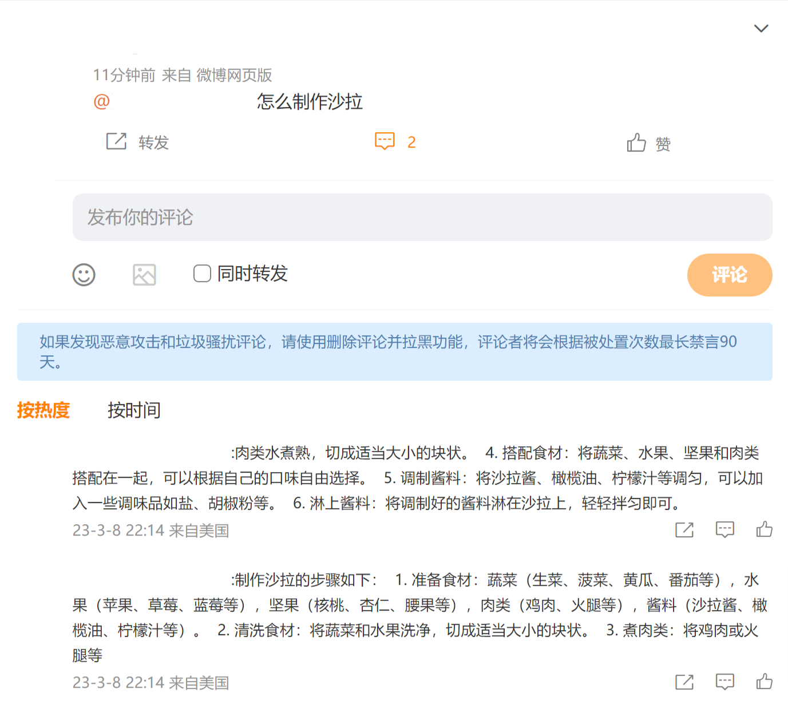

A self-host chatGpt bot.
Every post that @you would get a reply from chatgpt.

+ Now only support Weibo

# Screenshot


# Usage
## pnpm
```
// install dependency
pnpm install

// build app
pnpm run build

// start app
pnpm run start
```

## Docker
```
docker run 
    -v ./.env:/app.env 
    -e OPENAI_API_KEY=YOUR_KEY
    -e WEIBO_COOKIE=YOUR_COOKIE
    -e WEIBO_XSRF_TOKEN=YOUR_XSRF_TOKEN
    -e BASE_TIME_TO_WAIT=10000
    -e MAX_TIME_TO_WAIT=180000
    pikilee/chatboot:latest
```

### WEIBO_COOKIE，WEIBO_XSRF_TOKEN
+ You can find them in the network tab of browser dev tools when you are surfing weibo.

### BASE_TIME_TO_WAIT
+ The default time interval to pull data from weibo.
+ The interval would increase every time there is no data avaible and decrease to `BASE_TIME_TO_WAIT` every time there is data available.

### MAX_TIME_TO_WAIT
+ The interval to pull data would not supress `MAX_TIME_TO_WAIT`


## Docker compose
You can find `docker-compse.yml` file in the repository.
```
docker compose up -d
```

### .env
With docker compose you need to put your .env file in your current directory.

Here is the example of a .env file
```
OPENAI_API_KEY=YOUR_KEY
WEIBO_COOKIE=YOUR_COOKIE
WEIBO_XSRF_TOKEN=YOUR_XSRF_TOKEN
BASE_TIME_TO_WAIT=10000
MAX_TIME_TO_WAIT=180000
```